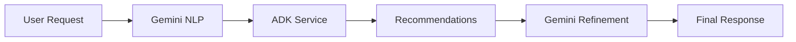

# Google Gemini and ADK Integration Plan

## Current Status

- Basic AI trip planner infrastructure in place
- Mock implementations for ADK service methods
- Error handling and validation implemented
- Test coverage for core functionality

## Integration Steps

### 1. Google Cloud Setup

- [ ] Create a Google Cloud Project
- [ ] Enable the Vertex AI API
- [ ] Enable the Google ADK API
- [ ] Create service account and download credentials
- [ ] Set up billing

### 2. Environment Configuration

```env
GOOGLE_CLOUD_PROJECT=your-project-id
GOOGLE_APPLICATION_CREDENTIALS=path/to/credentials.json
GEMINI_API_KEY=your-gemini-api-key
ADK_MODEL_ID=your-adk-model-id
```

### 3. Dependencies Update

Add to `backend/requirements.txt`:

```
google-cloud-aiplatform>=1.36.0
vertexai>=0.0.1
google-cloud-core>=2.3.3
google-auth>=2.23.0
```

### 4. ADK Service Implementation

#### a. ADK Service Client Setup

```python
# app/services/adk_client.py
import vertexai
from vertexai.language_models import TextGenerationModel
from google.cloud import aiplatform

class ADKClient:
    def __init__(self):
        vertexai.init(project=settings.GOOGLE_CLOUD_PROJECT)
        self.model = TextGenerationModel.from_pretrained(settings.ADK_MODEL_ID)
```

#### b. Travel Recommendations Implementation

- Replace mock data with actual ADK calls
- Implement proper prompts for each service
- Add response parsing and validation
- Maintain error handling

### 5. Gemini Integration

#### a. Gemini Service Setup

```python
# app/services/gemini_service.py
from google.cloud import aiplatform
import vertexai
from vertexai.language_models import TextGenerationModel

class GeminiService:
    def __init__(self):
        self.model = TextGenerationModel.from_pretrained("gemini-pro")
```

#### b. Key Features to Implement

- Natural language itinerary generation
- Travel insights and recommendations
- Context-aware responses
- Multi-turn conversations

### 6. Service Integration Points

1. Trip Planning Flow:



2. Context Management:

- Store conversation history
- Maintain user preferences
- Track session state

### 7. Testing Strategy

1. Unit Tests:

- [ ] ADK client methods
- [ ] Gemini service methods
- [ ] Response parsing
- [ ] Error handling

2. Integration Tests:

- [ ] End-to-end flows
- [ ] API response validation
- [ ] Error scenarios
- [ ] Rate limiting

3. Performance Tests:

- [ ] Response times
- [ ] Concurrent requests
- [ ] Resource usage

### 8. Monitoring and Logging

1. Key Metrics:

- API response times
- Error rates
- Usage patterns
- Cost tracking

2. Logging:

- Request/response payloads
- Error details
- Performance metrics

### 9. Cost Management

1. Implementation:

- [ ] Add rate limiting
- [ ] Implement caching where appropriate
- [ ] Monitor API usage
- [ ] Set up cost alerts

2. Optimization:

- Cache frequent requests
- Batch processing where possible
- Optimize prompt lengths

### 10. Security Considerations

1. API Security:

- [ ] Secure key storage
- [ ] Request validation
- [ ] Rate limiting
- [ ] Input sanitization

2. Data Privacy:

- [ ] PII handling
- [ ] Data retention policies
- [ ] User consent management

### 11. Documentation Updates

1. API Documentation:

- [ ] Update API specs
- [ ] Add example requests/responses
- [ ] Document error codes

2. Internal Documentation:

- [ ] Architecture diagrams
- [ ] Setup guides
- [ ] Troubleshooting guides

## Timeline

1. Week 1:

- Basic setup and configuration
- ADK client implementation

2. Week 2:

- Gemini service implementation
- Integration testing

3. Week 3:

- Performance optimization
- Security implementation

4. Week 4:

- Documentation
- Production deployment

## Next Immediate Steps

1. Set up Google Cloud project and credentials
2. Install required dependencies
3. Implement ADK client with basic functionality
4. Add Gemini service with basic prompts
5. Create initial integration tests
6. Deploy to staging environment

### 12. Advanced Integration Features

1. Multi-Modal Support:

- [ ] Image processing with Gemini Vision
- [ ] Video content analysis
- [ ] Audio processing capabilities

2. Contextual Understanding:

- [ ] User preference learning
- [ ] Historical interaction analysis
- [ ] Adaptive recommendations

3. Optimization Techniques:

- [ ] Response caching strategies
- [ ] Batch processing implementation
- [ ] Load balancing configuration

### 13. Authentication & Security

1. API Key Management:

```python
# app/core/config.py
from pydantic_settings import BaseSettings

class Settings(BaseSettings):
    GOOGLE_CLOUD_PROJECT: str
    GEMINI_API_KEY: str
    ADK_MODEL_ID: str

    class Config:
        env_file = ".env"
```

2. Service Account Setup:

```bash
# 1. Create service account
gcloud iam service-accounts create travel-ai-service \
    --display-name="Travel AI Service Account"

# 2. Grant necessary roles
gcloud projects add-iam-policy-binding YOUR_PROJECT_ID \
    --member="serviceAccount:travel-ai-service@YOUR_PROJECT_ID.iam.gserviceaccount.com" \
    --role="roles/aiplatform.user"

# 3. Create and download key
gcloud iam service-accounts keys create service-account-key.json \
    --iam-account=travel-ai-service@YOUR_PROJECT_ID.iam.gserviceaccount.com
```

3. Security Best Practices:

- Use environment variables for sensitive data
- Implement API key rotation
- Set up request signing
- Enable audit logging

### 14. Performance Optimization

1. Caching Strategy:

```python
from fastapi_cache import FastAPICache
from fastapi_cache.backends.redis import RedisBackend
from fastapi_cache.decorator import cache

@router.get("/adk/popular-destinations")
@cache(expire=3600)  # Cache for 1 hour
async def get_popular_destinations():
    return await ADKService.get_popular_destinations()
```

2. Rate Limiting:

```python
from fastapi import Request
from slowapi import Limiter
from slowapi.util import get_remote_address

limiter = Limiter(key_func=get_remote_address)

@router.post("/adk/recommendations")
@limiter.limit("10/minute")  # Limit to 10 requests per minute
async def get_recommendations(request: Request):
    # Implementation
```

3. Connection Pooling:

```python
from google.cloud import aiplatform

def get_vertex_client():
    return aiplatform.gapic.PredictionServiceClient(
        client_options={
            "api_endpoint": "us-central1-aiplatform.googleapis.com",
        }
    )
```

### 15. Deployment Configuration

1. Docker Setup:

```dockerfile
# Dockerfile
FROM python:3.11-slim

WORKDIR /app
COPY requirements.txt .
RUN pip install --no-cache-dir -r requirements.txt

COPY . .
ENV GOOGLE_APPLICATION_CREDENTIALS=/app/service-account-key.json

CMD ["uvicorn", "app.main:app", "--host", "0.0.0.0", "--port", "8000"]
```

2. Kubernetes Configuration:

```yaml
# kubernetes/deployment.yaml
apiVersion: apps/v1
kind: Deployment
metadata:
  name: travel-ai-service
spec:
  replicas: 3
  template:
    spec:
      containers:
        - name: travel-ai-service
          image: travel-ai-service:latest
          env:
            - name: GOOGLE_CLOUD_PROJECT
              valueFrom:
                secretKeyRef:
                  name: ai-service-secrets
                  key: project-id
```

3. CI/CD Pipeline:

```yaml
# .github/workflows/deploy.yml
name: Deploy to Production
on:
  push:
    branches: [main]
jobs:
  deploy:
    runs-on: ubuntu-latest
    steps:
      - uses: actions/checkout@v2
      - name: Build and Deploy
        run: |
          docker build -t travel-ai-service .
          docker push travel-ai-service
```

### 16. Monitoring & Observability

1. Logging Setup:

```python
import structlog

logger = structlog.get_logger()

async def log_request_info(request: Request, call_next):
    logger.info(
        "incoming_request",
        path=request.url.path,
        method=request.method
    )
    response = await call_next(request)
    return response
```

2. Metrics Collection:

```python
from prometheus_fastapi_instrumentator import Instrumentator

def setup_monitoring(app: FastAPI):
    Instrumentator().instrument(app).expose(app)
```

3. Alert Configuration:

```yaml
# alerting_rules.yml
groups:
  - name: AIServiceAlerts
    rules:
      - alert: HighErrorRate
        expr: rate(http_requests_total{status=~"5.."}[5m]) > 0.1
        for: 5m
        labels:
          severity: critical
```

### 17. Cost Management

1. Budget Alerts:

```bash
# Set up budget alert
gcloud billing budgets create \
    --billing-account=$BILLING_ACCOUNT_ID \
    --display-name="AI Service Monthly Budget" \
    --budget-amount=1000USD \
    --threshold-rules=percent=0.8 \
    --threshold-rules=percent=0.9,basis=forecasted_spend
```

2. Usage Monitoring:

```python
from google.cloud import monitoring_v3

def monitor_api_usage():
    client = monitoring_v3.MetricServiceClient()
    project_name = f"projects/{settings.GOOGLE_CLOUD_PROJECT}"

    # Configure what metrics to monitor
    interval = monitoring_v3.TimeInterval({
        "end_time": {"seconds": int(time.time())},
        "start_time": {"seconds": int(time.time() - 3600)},
    })
```

3. Cost Optimization:

- Implement request batching
- Use caching for frequent queries
- Set up auto-scaling based on demand

## Resources

- [Google ADK Documentation](https://cloud.google.com/adk/docs)
- [Vertex AI Documentation](https://cloud.google.com/vertex-ai/docs)
- [Gemini API Reference](https://cloud.google.com/vertex-ai/docs/generative-ai/model-reference/gemini)
- [Google Cloud Python Client](https://googleapis.dev/python/google-cloud/latest/index.html)
- [FastAPI Security](https://fastapi.tiangolo.com/tutorial/security/)
- [Google Cloud Security Best Practices](https://cloud.google.com/security/best-practices)
- [Kubernetes Documentation](https://kubernetes.io/docs/)
- [Prometheus Monitoring](https://prometheus.io/docs/)
